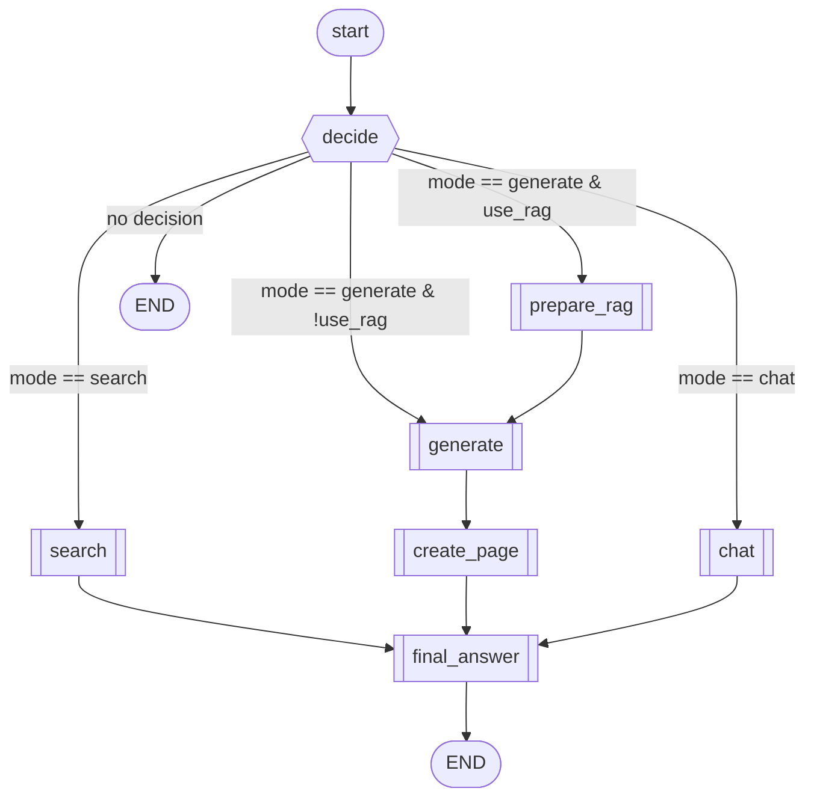

# LangGraph 오케스트레이션 개요

`WorkspaceAgentOrchestrator`는 `langgraph`의 `StateGraph`를 사용해 검색, 문서 생성, 일반 대화 흐름을 분기 처리합니다. 각 노드는 공통 상태(`AgentState`)를 공유하며, 비동기 노드 실행 결과를 머지해 다음 단계에서 활용합니다.

## 상태와 결과 구조
- **AgentState**: 질의어(`query`), 워크스페이스 정보(`workspace_idx`, `workspace_name`, `storage_uri`), DB 세션(`db`), 사용자 식별자(`user_idx`), 결정(`decision`), 검색 결과(`result`), 생성 컨텍스트(`retrieval`), 생성물(`generated_document`), 실행 모드(`mode`), 생성한 노션 페이지(`notion_page`), 최종 문장 다듬기 지침(`final_message_instructions`)을 포함합니다.
- **AgentExecutionResult**: 최종 모드(`search`/`generate`/`chat`), 사용자 응답(`result`), 대표 문서 URL/노션 페이지 ID·URL(존재 시), 의사결정, 생성된 문서를 API 계층에 반환합니다.

## 노드 정의와 역할
- **decide** (`_node_decide`)
  - `DecisionAgent`를 호출해 사용자의 요청을 `search`, `generate`, `chat` 중 하나로 분류하고, 생성 시 RAG 사용 여부(`use_rag`)와 지침을 수집합니다.
- **search** (`_node_search`)
  - `WorkspaceRAGSearchAgent.search`를 실행해 하이브리드 검색과 답변을 수행하고, 최상위 관련 문서 URL을 `result.top_url`에 저장한 뒤 모드를 `search`로 설정합니다.
- **prepare_rag** (`_node_prepare_rag`)
  - `WorkspaceRAGSearchAgent.retrieve_for_generation`으로 생성용 컨텍스트와 인용 정보를 수집합니다.
- **generate** (`_node_generate`)
  - `DocumentGenerationAgent.generate`를 호출해 RAG 컨텍스트(옵션)와 결정된 지침을 기반으로 마크다운 문서를 생성하고, 모드를 `generate`로 설정합니다.
- **create_page** (`_node_create_page`)
  - 생성된 문서로 노션 페이지를 만들고(`create_page_from_markdown`), 요약/URL을 포함한 사용자 응답(`SearchResult`)을 구성합니다.
- **chat** (`_node_chat`)
  - `ChatAgent`가 간단한 대화 응답을 생성하고 모드를 `chat`으로 설정합니다.
- **final_answer** (`_node_finalize`)
  - 검색/생성 결과 초안을 `FinalAnswerAgent`의 프롬프트로 한 번 정제한 뒤, 프런트엔드로 전달할 최종 `SearchResult`를 반환합니다.
  - `run(final_message_instructions=...)`으로 전달된 추가 지침이 있으면 최종 표현을 다듬을 때 함께 반영합니다.

> **모델 분리**
> 최종 답변 노드는 전용 Azure Chat 배포를 사용합니다. `.env`에 다음 환경 변수를 설정하세요:
> `FINAL_ANSWER_AZURE_OPENAI_API_KEY`, `FINAL_ANSWER_AZURE_OPENAI_ENDPOINT`, `FINAL_ANSWER_AZURE_OPENAI_API_VERSION`, `FINAL_ANSWER_AZURE_OPENAI_CHAT_DEPLOYMENT`, `FINAL_ANSWER_AZURE_OPENAI_CHAT_MODEL`(옵션, 미설정 시 `deployment` 값 사용)

## 그래프 연결 관계
- **진입점**: `decide`
- **조건 분기** (`_route_from_decision`)
  - `search` → `search`
  - `generate` + `use_rag=True` → `prepare_rag`
  - `generate` + `use_rag=False` → `generate`
  - `chat` → `chat`
  - 결정 부재 → `END`
- **고정 엣지**
  - `prepare_rag` → `generate`
 - `generate` → `create_page`
  - `search` → `final_answer`
  - `create_page` → `final_answer`
  - `final_answer` → `END`

## 실행 흐름 요약
1. `run`이 초기 상태(질의, 워크스페이스/사용자 정보, DB 세션, 저장소 URI)를 세팅하고 그래프를 `ainvoke`로 실행합니다.
2. `decide` 노드가 요청 성격과 RAG 필요 여부를 판정합니다.
3. 검색 분기: `search` 노드는 RAG 검색·답변을 수행한 뒤 종료합니다.
4. 생성 분기(RAG 포함):
   - `prepare_rag`가 생성용 컨텍스트와 인용을 확보합니다.
   - `generate`가 문서를 작성합니다.
   - `create_page`가 노션 페이지를 생성하고 사용자 응답을 완성합니다.
5. `final_answer`가 프롬프트 기반으로 검색/생성 결과 초안을 다듬어 최종 `SearchResult`를 구성합니다.
6. 최종 상태의 `mode`, `result`, 노션 페이지 정보(또는 검색 시 최상위 URL), 결정/생성 결과를 `AgentExecutionResult`로 반환합니다.
